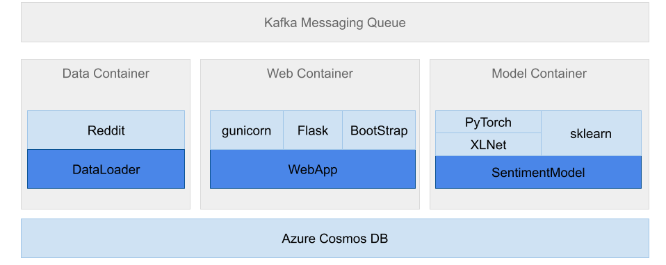

# Unit 21.6 Capstone Submission

The software stack for the Reddit Cryptocurrency Sentiment Analysis project uses a Python based backend with Bootstrap web UI delivered as Docker container.  The project is divided into 3 micro-services and delivered as containers: Data, Web and Model

The micro-services will be deployed to Azure Cloud as Azure Container instances.

|SW Component|Tool, utility or framework|Notes|
| ---------- | ------------------------ | --- |
|Container|Docker|Use Docker for deployment|
|Database|InfluxDB time series database.Other options: NoSQL, Cloud DB (Azure Cosmos)|Storage for reddit, etc social media comments|
|Data sources|Reddit||
|Scraper|Reddit API|Retrieve Reddit posts and comments|
|Distributed task queue|Celery|Parallelize Reddit scraping and inference tasks across multiple CPUs and GPUs|
|Messaging broker|RabbitMQ. Other options: Kafka||
|Python|Python 3.x||
|Machine Learning Framework|PyTorch||
|Deep learning model|Trained XLNet model|Huggingface XLNet|
|HTTP Server|Gunicorn or Flask built-in HTTP server||
|Web backend framework|Flask||
|Web UI|Bootstrap||

